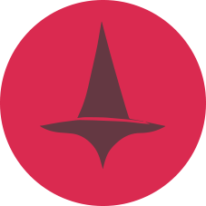

<br>
<p align="center"></p>
<h1 align="center">CtoD</h1>
<h3 align="center">Chat To Data</h3>

<h6 align="center">
    <a href="https://www.npmjs.com/package/ctod">
        
    </a>
    <a href="https://github.com/KHC-ZhiHao/ctod">
        
    </a>
    <br>
</h6>

<p align="center">
    English  | 
    <a href="./README_ZH.md">繁體中文</a>
</p>

<br>

## Summary

Nowadays, we frequently need to assign tasks to LLMs in a conversational manner and request JSON responses. CtoD allows you to structure this pattern in an organized way.

During the conversation, CtoD uses [zod](https://zod.dev/basics) to validate whether the request and response data meet expectations, ensuring consistency. By maintaining this interaction pattern, you can utilize it for API integration or automation systems.

We also support mainstream LLM services such as `OpenAI`, `Google`, `X`, `anthropic`, `llama.cpp`, both cloud-based and local.

## Installation

npm:

```bash
npm install ctod
```

yarn:

```bash
yarn add ctod
```

## Quick Start

This example demonstrates how to pass a medication index and customer requirements to a chatbot and return the most suitable results. Developers can use the index results to search the database for the most appropriate medication for consumers:

```ts
import { CtoD, OpenAICtodService, paragraph } from 'ctod'
    
const ctod = new CtoD({
    request: OpenAICtodService.createChatRequestWithJsonSchema({
        apiKey: 'YOUR_API_KEY',
        config: {
            model: 'gpt-4o'
        }
    })
})

const brokerBuilder = ctod.createBrokerBuilder<{
    indexes: string[]
    question: string
}>({
    install: ({ attach }) => {
        attach('start', async({ setPreMessages }) => {
            setPreMessages([
                {
                    role: 'system',
                    content: 'You are a pharmacist skilled at categorizing indexes'
                }
            ])
        })
    }
})

const broker = brokerBuilder.create(async({ zod, data, setMessages }) => {
    const { indexes, question } = data
    setMessages([
        {
            role: 'user',
            contents: [
                {
                    type: 'text',
                    content: paragraph([
                        'I have the following indexes',
                        `${JSON.stringify(indexes)}`,
                        `Please help me analyze which index "${question}" might belong to`,
                        'And sort by relevance from high to low with a score ranging from 0 to 1'
                    ])
                }
            ]
        }
    ])
    const item = zod.object({
        name: zod.string().describe('Index name'),
        score: zod.number().describe('Score')
    })
    return {
        indexes: zod.array(item).describe('Indexes sorted from high to low')
    }
})

broker.request({
    indexes: ['Stomach pain', 'Back pain', 'Headache', 'Sore throat', 'Limb pain'],
    question: 'Drinking coffee, eating sweets, acid reflux'
}).then(e => {
    console.log('Output:', e.indexes)
    /*
        [
            {
                name: 'Stomach pain',
                score: 1
            },
            {
                name: 'Sore throat',
                score: 0.7
            },
            ...
        ]
     */
}).catch(error => {
    console.error('Error:', error)
})
```

## Plugin

While Broker itself can handle most tasks, Plugins can help improve complex workflows and assist in project engineering.

Each time a request is sent, Broker triggers a series of lifecycles. You can understand the parameters and behaviors of each lifecycle from the [source code](./lib/broker/chat.ts) and modify their behaviors.

Now, let's say we want to design a plugin that backs up messages to the server after each conversation ends:

```ts
import axios from 'axios'
import { CtoDPlugin } from 'ctod'
const backupPlugin = new CtoDPlugin({
    name: 'backup-plugin',
    // Define parameter as sendUrl
    params: zod => {
        return {
            sendUrl: zod.string()
        }
    },
    // You can receive information during execution, and the information structure is defined here.
    receiveData: zod => {
        return {
            character: zod.string()
        }
    },
    onInstall({ params, attach, receive }) {
        const store = new Map()
        // If we have more custom information that needs to be passed in, it can be passed through plugins[key].send({ ... }) during the start phase
        // See the "Ask the bot to roleplay" case in the Applications category
        receive(({ id, context }) => {
            store.get(id).context = context
        })
        // Initialize data on first conversation
        attach('start', async({ id }) => {
            store.set(id, {
                messages: [],
                context: null
            })
        })
        // Save the conversation to state after each conversation
        attach('talkAfter', async({ id, lastUserMessage }) => {
            store.get(id).messages.push(lastUserMessage)
        })
        // Backup data after conversation ends
        attach('done', async({ id }) => {
            await axios.post(params.sendUrl, store.get(id))
            store.delete(id)
        })
    }
})

const ctod = new CtoD({
    // ...
    plugins: () => {
        return {
            backup: backupPlugin.use({
                sendUrl: 'https://api/backup'
            })
        }
    }
})
```

## Examples

[Basic Usage - Medication Query Function](./examples/openai.ts)

[Advanced Usage - Ask AI to COSPLAY](./examples/plugin.ts)

## Version History

### 1.0.x

1. Support zod as schema definition tool and remove yup support.
2. Use nodenext as compilation target.
3. Change Google Service to use @google/genai package.
4. Rename Llama3Cpp to LlamaCpp.

### 0.9.x

1. OpenAI API update, now you can set baseUrl through `setBaseUrl` method.
2. Add support for X Ai Service

### 0.8.x

1. Standardize Service naming
2. Add support for Google Service

### 0.7.x

Thanks to today's model support for json schema, we no longer need tedious declarations, so we added a simplified process through CtoD registration.

### 0.6.x

`bindYupToJsonSchemaToYup` had some dependency issues and has been removed, replaced with the following solution:

```ts
yup.array(item).required().meta({
    jsonSchema: {
        description: 'Indexes sorted from high to low'
    }
})
```

1. Added defineYupSchema to make creating complex Outputs easier.

### 0.5.x

Removed JSON Schema Info support and instead generate data formats through [yup-to-json-schema](https://github.com/sodaru/yup-to-json-schema).

Since the `yup-to-json-schema` extension requires global registration to use the `yup.string().description()` method, we provide the `bindYupToJsonSchemaToYup` method here, allowing users to decide whether to register.

1. Can respond with array in question, which will be merged through join.
2. Install parameter can now be omitted.

### 0.4.x

Mainly adjustments to support llama3.cpp or other self-hosted service workflows.

1. Support llama3.cpp server service
2. Add yup to json schema.

### 0.3.x

To support more platforms and self-hosted services, we abandoned the fully customized interface for ChatGPT, which also maintains the consistency of Broker and Plugin.
