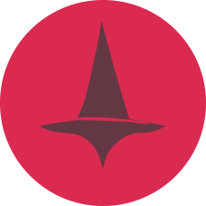

<br>
<p align="center"></p>
<h1 align="center">CtoD</h1>
<h3 align="center">Chat To Data</h3>

<h6 align="center">
    <a href="https://www.npmjs.com/package/ctod">
        
    </a>
    <a href="https://github.com/KHC-ZhiHao/ctod">
        
    </a>
    <br>
</h6>

<p align="center">
    <a href="./README.md">English</a>  | 
    繁體中文
</p>

<br>

## 摘要

現在我們頻繁的有透過口語化的方式交付任務 LLM 處理並要求回應 JSON 的需求，透過 CtoD 你可以讓這個模式有架構化的進行。

在對話過程中，CtoD 採用 [zod](https://zod.dev/basics) 來驗證請求與回復資料是否符合預期，以確保一致性，只要保持這個互動模式，就可以利用在 API 串接或是自動化系統上。

我們還附帶支援 `OpenAI`, `Google`, `X`, `anthropic`, `llama.cpp` 等主流 LLM 雲端或本地服務。

## 安裝

npm:

```bash
npm install ctod
```

yarn:

```bash
yarn add ctod
```

## 快速開始

這個例子示範如何將藥物索引與客戶需求傳遞給聊天機器人，並返回最適合的結果，開發人員可以利用索引結果去資料庫搜尋最適合的藥物給消費者：

```ts
import { CtoD, OpenAICtodService } from 'ctod'
    
const ctod = new CtoD({
    request: OpenAICtodService.createChatRequestWithJsonSchema({
        apiKey: 'YOUR_API_KEY',
        config: {
            model: 'gpt-4o'
        }
    })
})

const brokerBuilder = ctod.createBrokerBuilder<{
    indexes: string[]
    question: string
}>({
    install: ({ attach }) => {
        attach('start', async({ setPreMessages }) => {
            setPreMessages([
                {
                    role: 'system',
                    content: '你現在是一位擅長分類索引的藥師'
                }
            ])
        })
    }
})

const broker = brokerBuilder.create(async({ zod, data, setMessages }) => {
    const { indexes, question } = data
    setMessages([
        {
            role: 'user',
            content: [
                '我有以下索引',
                `${JSON.stringify(indexes)}`,
                `請幫我解析"${question}"可能是哪個索引`,
                '且相關性由高到低排序並給予分數，分數由 0 ~ 1'
            ]
        }
    ])
    const item = zod.object({
        name: zod.string().describe('索引名稱'),
        score: zod.number().describe('評比分數')
    })
    return {
        indexes: zod.array(item).describe('由高到低排序的索引')
    }
})

broker.request({
    indexes: ['胃痛', '腰痛', '頭痛', '喉嚨痛', '四肢疼痛'],
    question: '喝咖啡，吃甜食，胃食道逆流'
}).then(e => {
    console.log('輸出結果：', e.indexes)
    /*
        [
            {
                name: '胃痛',
                score: 1
            },
            {
                name: '喉嚨痛',
                score: 0.7
            },
            ...
        ]
     */
}).catch(error => {
    console.error('Error:', error)
})
```

##  Plugin

雖然 Broker 本身已經能夠處理大部分的事務，但透過 Plugin 可以協助改善複雜的流程，幫助專案工程化。

每次發送請求時，Broker 會觸發一系列的生命週期，你可以從[原始碼](./lib/broker/chat.ts)中了解每個生命週期的參數與行為，並對其行為進行加工。

現在，假設我們想要設計一個插件，它會在每次對話結束時將訊息備份到伺服器上：

```ts
import axios from 'axios'
import { CtoDPlugin } from 'ctod'
const backupPlugin = new CtoDPlugin({
    name: 'backup-plugin',
    // 定義參數為 sendUrl
    params: zod => {
        return {
            sendUrl: zod.string()
        }
    },
    // 現階段你可以在執行過程中接收到資訊,資訊結構由這裡定義。
    receiveData: zod => {
        return {
            character: zod.string()
        }
    },
    onInstall({ params, attach, receive }) {
        const store = new Map()
        // 假設我們有更多的自訂義資訊需要被傳遞進來，可以在 start 階段透過 plugins[key].send({ ... }) 傳遞
        // 可以從 Applications 分類中的 請機器人角色扮演 觀看案例
        receive(({ id, context }) => {
            store.get(id).context = context
        })
        // 第一次對話的時候初始化資料
        attach('start', async({ id }) => {
            store.set(id, {
                messages: [],
                context: null
            })
        })
        // 每次對話完畢後把對話存入狀態
        attach('talkAfter', async({ id, lastUserMessage }) => {
            store.get(id).messages.push(lastUserMessage)
        })
        // 結束對話後備份資料
        attach('done', async({ id }) => {
            await axios.post(params.sendUrl, store.get(id))
            store.delete(id)
        })
    }
})

const ctod = new CtoD({
    // ...
    plugins: () => {
        return {
            backup: backupPlugin.use({
                sendUrl: 'https://api/backup'
            })
        }
    }
})
```

## Examples

[基礎用法 - 藥物查詢功能](./examples/openai.ts)

[進階用法 - 請 AI COSPLAY](./examples/plugin.ts)

## Version History

### 1.0.x

1. 支援 zod 作為 schema 定義工具，並移除 yup 的支援。
2. 改由 nodenext 作為編譯目標。
3. 將 Google Service 改使用 @google/genai 套件。
4. 將 Llama3Cpp 改名為 LlamaCpp。

### 0.9.x

1. OpenAI 的 API 更新，現在可以透過 `setBaseUrl` 方法來設定 baseUrl。
2. 新增 X Ai Service 的支援

### 0.8.x

1. 正規化 Service 的命名
2. 新增 Google Service 的支援

### 0.7.x

感謝當今的模型對於json schema的支援，我們不再需要繁瑣的宣告，因此新增了透過註冊 CtoD 的方式來簡化流程。 

### 0.6.x

`bindYupToJsonSchemaToYup` 有一些依賴問題已經被移除，改用以下方案取代：

```ts
yup.array(item).required().meta({
    jsonSchema: {
        description: '由高到低排序的索引'
    }
})
```

1. 新增了 defineYupSchema 讓建立複雜的 Output 更加容易。

### 0.5.x

移除了 JSON Schema Info 的支援，而是透過 [yup-to-json-schema](https://github.com/sodaru/yup-to-json-schema) 進行生成資料格式。

由於 `yup-to-json-schema` 的延伸套件要使用 `yup.string().description()` 方法需要進行全域註冊，在此我們提供了 `bindYupToJsonSchemaToYup` 這個方法，讓使用者可以自行決定是否要進行註冊。

1. 可以在 question 中回應 array，會透過 join 進行合併。
2. 可以省略 install 參數了。

### 0.4.x

主要是支援 llama3.cpp 或者是其他自建服務上流程的調整。

1. 支援 llama3.cpp server service
2. 新增 yup to json scheme。

### 0.3.x

為了支援更多平台與自建服務，我們捨棄了完全為了 ChatGPT 客制化的接口，這樣也能完整保持 Broker 與 Plugin 的一致性。
